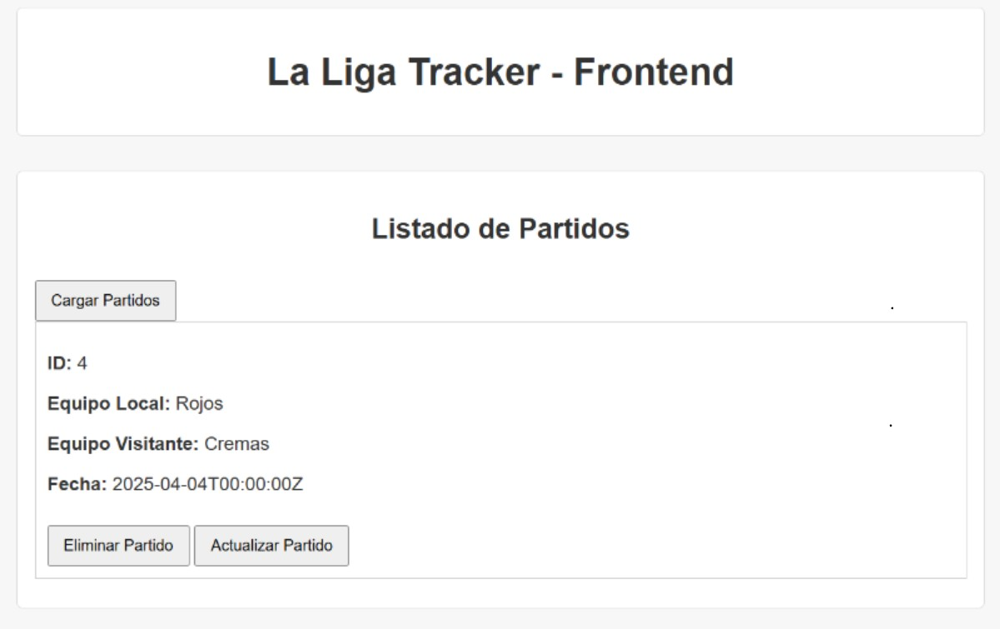

# ⚽ LaLiga Tracker

🌐 **LaLiga Tracker** es una API desarrollada en **Golang** que centraliza la administración de encuentros deportivos, ofreciendo operaciones completas de creación, consulta, modificación y eliminación de partidos.



---

## 🔥 Funcionalidades Principales

🚩 **Gestión completa de partidos**  
   - Registra nuevos encuentros deportivos  
   - Consulta historial de partidos con filtros  
   - Actualiza información en tiempo real  
   - Elimina registros obsoletos  

🗃️ **Almacenamiento robusto**  
   - Motor PostgreSQL para gestión de datos  
   - Modelado relacional optimizado  
   - Escalabilidad garantizada  

🌍 **Acceso multiplataforma**  
   - Configuración CORS para integración frontal  
   - Compatibilidad con cualquier cliente REST  

---

## 🛠 Stack Tecnológico

### 🔧 Backend
- **Lenguaje**: Go 1.20+  
- **Framework**: Gin Gonic  
- **Autenticación**: JWT Middleware  

### 🗃️ Persistencia
- **Base de datos**: PostgreSQL 15  
- **ORM**: GORM v2  
- **Migrations**: Automatizadas  

---

### 📥 Clonación del repositorio
```bash
git clone https://github.com/GerardoFdez7/backend-laliga.git
cd backend-laliga
```
